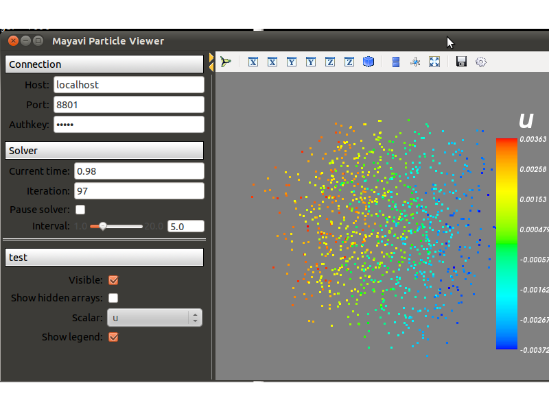

=============================================
Using the PySPH Application interface
=============================================

PySPH provides a powerful feature called the Application Interface
which provides full control of the solver parameters via a command
line interface. Moreover, you can launch the same code on a serial
machine, a distributed computing environment (MPI) or on a GPU using
PyOpenCL.

----------------
Serial runs
----------------

We continue with the :doc:`getting_started` example to demonstrate the
use of the Application interface.

..  sourcecode:: python
	:linenos:

	import pysph.base.api as base
	import pysph.solver.api as solver
	import pysph.sph.api as sph
	import numpy

	Fluid = base.ParticleType.Fluid
	
	# Generate random points in the cube [-1, 1] X [-1, 1] X [-1,1]
	x = numpy.random.random(1000) * 2.0 - 1.0
	y = numpy.random.random(1000) * 2.0 - 1.0
	z = numpy.random.random(1000) * 2.0 - 1.0
	m = numpy.random.random(1000)

	def get_particles(**kwargs):
	    
	    pa = base.get_particle_array(name="test", cl_precision="single",
                                       type=Fluid, x=x, y=y, z=z, m=m)
      				       				   
            particles = base.Particles(arrays=[pa,])

	    return particles

	app = solver.Application()
	app.process_command_line()
	 
	particles = app.create_particles(
              callable=get_particles,
	      locator_type=base.NeighborLocatorType.NSquareNeighborLocator,
	      cl_locator_type=base.OpenCLNeighborLocatorType.AllPairNeighborLocator,
	      )
	    
	s = solver.Solver(dim=3,
                  integrator_type=solver.EulerIntegrator)

	s.add_operation(solver.SPHIntegration(

                sph.NBodyForce.withargs(),
                on_types=[Fluid], from_types=[Fluid],
                updates=['u','v','w'], id='nbody_force')

                  )

	s.add_operation_step([Fluid])

	s.set_final_time(tf)
	s.set_time_step(dt)	

	app.set_solver(s)
	app.run()

In this example we construct an application instance and tell it that
we want to process any command line arguments as::

   app = solver.Application()
   app.process_command_line()

We then ask the application to create a **Particles** instance that
represents all the ParticleArrays in our simulation::

	particles = app.create_particles(
              callable=get_particles,
	      locator_type=base.NeighborLocatorType.NSquareNeighborLocator,
	      cl_locator_type=base.OpenCLNeighborLocatorType.AllPairNeighborLocator,
	      )

here *callable* is any function that will return a list of
**ParticleArrays** that will be used in the simulation. This list is
used to construct the cell indexing scheme used for the simulation and
we pass in extra arguments to determine how this scheme is to be
constructed.

In the example above, we tell the application that we use an n-square
algorithm for the neighbors of a particle. The other available
locators are defined in the nnps module.

We then proceed to define the **Solver** and add the Operations like
before. To run the application, we call it's *run* method like::

	app.run()

The above script can now be invoked from the command line like::

    $ python nbody.py [options]

To list the available options, you can run it like so::

   $ python nbody.py -h

---------------------------
Parallel runs
---------------------------

The advantage of the above script is that we can run the same code in
serial or parallel depending on the command used to invoke the script.

To run an example using `n` jobs with MPI::

   $ mpirun -n <n> python nbody.py

To run the example using OpenCL::

   $ pythonn nbody.py --cl

If you have `Mayavi
<http://code.enthought.com/projects/mayavi>`_
installed, you can view the results interactively::

   $ pysph-viewer

.. _image_controller:

See :doc:`solver_interfaces` for a description of the viewer.

.. _N-Body: getting_started
