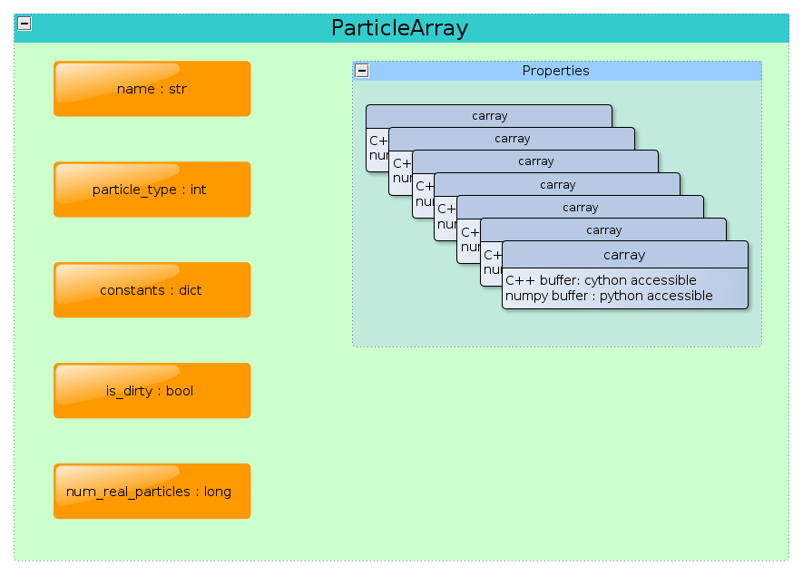

.. _working_with_particles:

==============
ParticleArray
==============

Particles are ubiquitous in SPH and in PySPH. The domain is
discretized with a finite number of points, to which are assigned
physical properties corresponding to the fluid being modelled. This
leads us to the concept of a set of arrays that represent a fluid. 

In PySPH, a *homogeneous* collection of particles is represented by a
**ParticleArray** as shown in the figure:

.. _figure_particle_array:

The figure shows only a subset of the attributes of a
**ParticleArray** pertinent to this discussion. Refer to the reference
documentation (:doc:`../reference/particle_array`) for a more complete
listing of class attributes and methods.

-------------------------
Creating particle arrays
-------------------------

From the user's perspective, a :class:`ParticleArray` may be created like so:
 ..  sourcecode:: python

	 import numpy

     	 # Import the base module
     	 import pysph.base.api as base

	 # create the numpy arrays representing the properties
	 x = numpy.linspace(...)
	 y = numpy.linspace(...)
	 .
	 .
	 .
	 f = numpy.sin(x)

	 fluid = base.get_particle_array(name="fluid", x=x, y=y, ..., f=f)

This creates an instance of a :class:`ParticleArray`, *fluid* with the
requested properties. From within python, the properties may be
accessed via the standard attribute access method for Python objects::

	 In [10] : fluid.x
	 Out[4] : array([....])

^^^^^^^^^^^^^^^^^^^^^^^^^^^^^^^^^^^
Important ParticleArray attributes
^^^^^^^^^^^^^^^^^^^^^^^^^^^^^^^^^^^

**name**: PySPH permits the use of multiple arrays and warrants the
  use of a unique name identifier to distinguish between different
  particle arrays.

**particle_type**: A :class:`ParticleArray` represents a homogeneous
  collection of particles in that they correspond to a particular
  *type*. The available types are an enumerated list:

 * Fluid     : Used for fluids
 * Solid     : Used for moving solids
 * Boundary  : Used for fixed boundaries
 * Ghost     : Particles added for periodic boundary conditions.

The type of a particle array plays an important role in setting up a
simulation involving multiple arrays with different types. Refer to
:doc:`particle_types` for a detailed description.

Properties that are constant in space and time for all particles of a
given type are stored in the *constants* attribute.

**is_dirty**: In PySPH, the indexing scheme for the particles may be
  rendered invalid after updating the particle properties. Moreover,
  other particle arrays like stationary boundaries remain fixed and
  the initial indexing is valid.. The *is_dirty* flag essentially
  helps PySPH distinguish these two cases, thus saving time that would
  have been spent re-indexing these particles. Thus, setting the
  *is_dirty* flag for a :class:`ParticleArray` forces PySPH to
  re-compute neighbors for that array.

**num_real_particles**: Every :class:`ParticleArray` object is given a
  set of deault properties (see
  :doc:`particle_array_default_properties`), one of which is the *tag*
  property. The *tag* of a particle is an integer which is used by
  PySPH to determine if a particle belongs to a remote processor (0
  local, else remote). The *num_real_particles* attributes counts the
  number of properties that have the tag value 0. 			

--------------
Data bufers
--------------

The :class:`carray` object serves as the data buffer for a particle
property. A single :class:`carray` is created for each property
requested

..  LocalWords:  ParticleArray num deault carray
