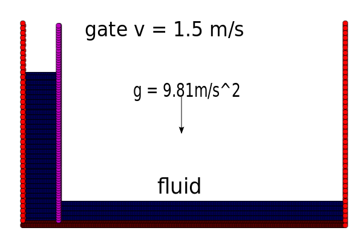

.. _examples:

----------------------
Running the examples
----------------------

The :file:`examples` directory is the best place to start off using
PySPH. In it are examples for the different solvers implemented in
for PySPH. The directory structure is shown below::

    examples/
    | -- controller
    |    `--  mimic
    | -- dam-break
    | -- shock-tube
    ` -- stress

Files in the :file:`examples` directory are "examples" that are used for
validation. That is, they don't fit into the testing framework and
they are not exactly examples.

Each directory contains related examples. The relation being the type
of solver employed. Thus, all examples in the :file:`shock-tube`
directory employ a solver for the Euler equations while files in the
:file:`stress` directory employ a solver that incorporates linear
material strength.

All examples can be run like so::

    $ cd <example_directory>
    $ python example.py [options]

Output for the examples will be placed in a directory
:file:`example_output` and output files will have the file-name
:file:`example_pid_count.npz`, where :token:`pid` is the processor
rank that created this file (default is 0 for serial runs) and
:token:`count` is the iteration count for the solution output.

Each example accepts command line arguments which may vary depending
on the kind of solver employed. To get a list of valid options::

   $ python example.py -h

-------------------------------------------------------
Example: Running a dam break simulation with PySPH
-------------------------------------------------------

The above generic procedure to run an example is demonstrated by way
of a concrete example, the 2D dam break problem. The example file we
will be referring to is
:file:`examples/dam-break/dam_break_wet_bed.py`, which simulates the
evolution of a breaking dam in the presence of a wet bed of fluid as
shown in the figure:

.. _figure-wet-bed:

The vertical gate is removed at a constant velocity of :math:`v =
1.5m/s`. The fluid is free to fall under the effect of gravity. The
no-penetration boundary condition is applied at the solid walls. This
example is defined as `SPHERIC
<http://www.wiki.manchester.ac.uk/spheric/index.php/SPHERIC_Home_Page>`_
validation case.

The example can be run like so::

    $ cd examples/dam-break
    $ python dam_break_wet_bed.py

A small progress indicator informs about the status of the
example. The output files for this example are created in the
directory :file:`dam_break_wet_bed_output`.

If you are looking to run a quick example, the
:file:`dam_break_simple.py` runs rather quickly.

"""""""""""""""""""""""""""""""""
Viewing the output
"""""""""""""""""""""""""""""""""

Viewing a running simulation
~~~~~~~~~~~~~~~~~~~~~~~~~~~~~

There are two ways to view the output.  You can view the output as the
solver is running and depending on the simulation you may need to be
patient.  By default every solver will start up a special solver
interface that can be used to view and control the running simulation.
More internal details can be seen in :doc:`here
</design/solver_interfaces>`.  The upshot here is that you can view the
results of the simulation while the solver is running.  The results are
most easily visualized using the `Mayavi
<http://www.code.enthought.com/projects/mayavi>`_ viewer, this will work
only if you have Mayavi installed.  If you have Mayavi installed you may
view the results by running the following command in another shell::

    $ pysph_viewer

This will pop-up a full fledged UI with which you can view a running
simulation.  The solver will continue to run regardless of the state of
the viewer so you may close the window at any time.  The viewer has
several options to see a listing of this run the following::

    $ pysph_viewer -h

Viewing the output of a simulation
~~~~~~~~~~~~~~~~~~~~~~~~~~~~~~~~~~~~

Given a bunch of output files, like those generated by running the
example above, you can view the output files as follows::

	$ cd dam_break_wet_bed_output
	$ pysph_viewer *.npz 

The viewer will load all available solution files starting from the
initial configuration (:token:`count` 0). The current file is
displayed in the left pane of the viewer. Also in the left pane are
tabs for the different entities present in the simulation
(:token:`gate`, :token:`tank`, :token:`fluid`).  Ensure that the
:guilabel:`Show legend` checkbox is only checked for the
:guilabel:`fliud` tab. Now you can watch an animation of the solution
by checking the :guilabel:`Play` checkbox in the upper part of the
left pane. What results is an animation of the evolution with particle
positions colored by their density values.

You can also instruct the viewer to dump a sequence of :file:`.png`
files by checking the :guilabel:`Record` checkbox under the
:guilabel:`Movie` tab. This will produce a sequence of files named
:file:`frame<frameno>.png` in the
:file:`dam_break_wet_bed_output/movie` directory.

