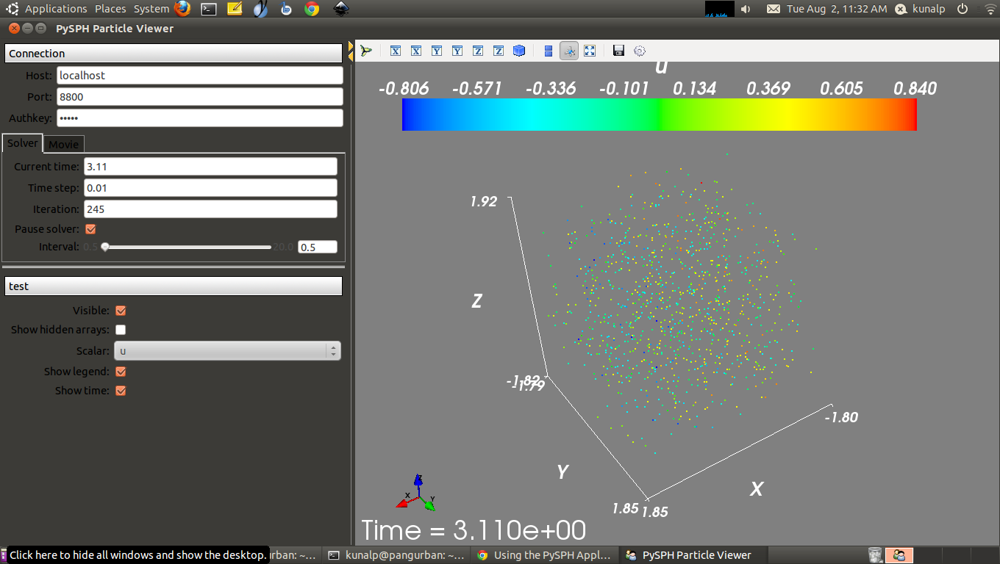

=============================================
Using the PySPH Application interface
=============================================

While investigating a problem, it is often useful to consider slight
numerical variations. These may be in the form of a parameter study,
convergence study as the resolution is increased, a different
integration scheme or as in the case with SPH, a different kernel
function.

The :mod:`solver` module (:doc:`design/solver`) is entirely
configurable in this respect, but must be manually *re-configured* for
each separate case. This leads to a tedious cycle of editing the code
to the particular requirements and then re-running the case, which
leaves the door ajar to possible errors.

PySPH provides a powerful feature called the Application Interface
which provides full control of the solver parameters via a command
line interface. This saves time while varying parameters and does away
with the error prone edit-rerun cycle.

Moreover, with the help of the application interface, you can launch
the same code on a serial machine, a distributed computing environment
(MPI) or on a GPU using PyOpenCL.

-------------------------------
N-Body problem revisited
-------------------------------

Consider once again, the N-Body problem as described in the
:doc:`getting_started` guide.

.. code-block:: python
    :linenos:

    import pysph.base.api as base
    import pysph.solver.api as solver
    import pysph.sph.api as sph
    import numpy

    Fluid = base.ParticleType.Fluid
    
    # Generate random points in the cube [-1, 1] X [-1, 1] X [-1,1]
    x = numpy.random.random(1000) * 2.0 - 1.0
    y = numpy.random.random(1000) * 2.0 - 1.0
    z = numpy.random.random(1000) * 2.0 - 1.0
    m = numpy.random.random(1000)

    def get_particles(**kwargs):
        pa = base.get_particle_array(name="test", cl_precision="single",
                                       type=Fluid, x=x, y=y, z=z, m=m)
        particles = base.Particles(arrays=[pa,])
        return particles

    app = solver.Application()
     
    s = solver.Solver(dim=3,
                  integrator_type=solver.EulerIntegrator)

    s.add_operation(solver.SPHIntegration(
                sph.NBodyForce.withargs(),
                on_types=[Fluid], from_types=[Fluid],
                updates=['u','v','w'], id='nbody_force')
                  )

    s.add_operation_step([Fluid])
    s.set_final_time(tf)
    s.set_time_step(dt) 

    app.setup(solver=s, create_particles=get_particles,
              locator_type=base.NeighborLocatorType.NSquareNeighborLocator,
              cl_locator_type=base.OpenCLNeighborLocatorType.AllPairNeighborLocator)
    app.run()

We remark that the code is essentially identical to the one presented
earlier. We elaborate on the differences. Read the
:doc:`getting_started` guide for a general description of the code.

^^^^^^^^^^^^^^^^^^^^^^^^^^^^^^^^
The *create_particles* function
^^^^^^^^^^^^^^^^^^^^^^^^^^^^^^^^

As opposed to the previous example, we require, that the code to
generate the :class:`Particles` object is put into a function:

.. function:: create_particles(**kwargs) -> list of ParticleArray objects

The function **must** accept arbitrary keyword arguments. This is
because the application will, at some point call this function for us
and pass in a big list of keyword arguments, some of which are needed
for the function (to change the particle resolution etc.). Although not
shown for the example here, the function should check for the required
arguments and raise an error if something is awry.

The function returns a list of :class:`ParticleArray` objects which
will be used in the simulation (see
:doc:`../design/working_with_particles`)

^^^^^^^^^^^^^^^^^^^^^^^^^^^^^^^^^^
Instantiating the  Application
^^^^^^^^^^^^^^^^^^^^^^^^^^^^^^^^^^

To use the application interface, you must instantiate an
:class:`Application` object::

   app = solver.Application()

^^^^^^^^^^^^^^^^^^^^^^^^^^^^^^^^^^^^^
Setting up the application
^^^^^^^^^^^^^^^^^^^^^^^^^^^^^^^^^^^^^

The :class:`Application` object defines a setup method,

.. method:: setup(solver, create_particles[, locator_type])

which must be called after the operations are added to the
solver. Notice that our function to generate the particles is passed
as an argument. The :class:`Application` instance will create the
particles, passing any additional arguments to this function.

PySPH is ready to solve the problem after a call to this function. The
:class:`Particles` instance is created and all solver parameters are
configured.::

    app.setup(solver=s, create_particles=get_particles,
              locator_type=base.NeighborLocatorType.NSquareNeighborLocator,
              cl_locator_type=base.OpenCLNeighborLocatorType.AllPairNeighborLocator)

^^^^^^^^^^^^^^^^^^^^^^^
Running the example
^^^^^^^^^^^^^^^^^^^^^^^

We run the example by calling the :class:`Application` object's
:func:`run` method::

		   app.run()

---------------------------
Command line arguments
---------------------------

For any example that uses the application interface, a list of all
valid command line options can be obtained like so::

      $ python example.py -h

As mentioned earlier, the application can be used to tune all
parameters of the :class:`Solver` object. This includes logging,
time-step control, integration method, parallel solution method and
file output. 

^^^^^^^^^^^^^^^^^^^^^^^^^^^^^^^^
Logging and verbosity
^^^^^^^^^^^^^^^^^^^^^^^^^^^^^^^^

These options can be used to control the logging output from PySPH.

.. cmdoption:: -v : Set the logging verbosity level. Valid values : [info, none, warning, critical, error]
   	       	
.. cmdoption:: -q : Quiet mode. Do not print any progress information.

.. cmdoption:: -l : Print log messages to stderr.

.. cmdoption:: --logfile : Set the logfile to use.

^^^^^^^^^^^^^^^^^^^^^^^^^
Time step control
^^^^^^^^^^^^^^^^^^^^^^^^^

The final time and the time-step for a simulation may be set using the
following options:

.. cmdoption:: --final-time: Set the final time for the simulation

.. cmdoption:: --timestep : Set the time step for the simulation.

.. note:: 
   For problems that compute a dynamic time step based, the *timestep* option
   is redundant.

^^^^^^^^^^^^^^^^^^^^^^^^^^^^^^^
Controlling the solution output
^^^^^^^^^^^^^^^^^^^^^^^^^^^^^^^

The output files produced by output have the following components:
 * filename : The base file name for the problem
 * pid : The processor id that produced this output.
 * iteration : The iteration count for the output.

Using this, the output file produced is *filename_pid_iteration.npz*.

It is important to understand the output generated by PySPH. See
:doc:`design/output` for a complete description. The following options
can be used to fine tune the output:

.. cmdoption:: -o : Filename to use for the output.

   By default, PySPH will use the file name of the example (without
   the .py extension) for the name of the output file. 

.. cmdoption:: -d, --detailed-output: Perform detailed output

   All particle properties that begin with an underscore are
   considered private and ignored for output. Use this option to force
   PySPH to print these variables as well.

.. cmdoption:: --directory: The output directory for file output. Defaults to filename_output in the working directory.

.. cmdoption:: --output-freq : Iteration count between successive file output.

^^^^^^^^^^^^^^^^^^^^^^^^^^^^^^^^^^^^^^^^^^^^^
Setting the SPH kernel and integration method
^^^^^^^^^^^^^^^^^^^^^^^^^^^^^^^^^^^^^^^^^^^^^

.. cmdoption:: -k, --kernel-correction : Use kernel correction. Valid values: [0: Bonnet and Lok kernel correction]

.. cmdoption:: --kernel : The SPH kernel function to use. Valid values: [CubicSplineKernel, GaussianKernel, QuinticSplineKernel, HarmonicKernel]

.. cmdoption:: --integration: Integration method to use. Valid values: [EulerIntegrator, RK2Integrator, RK4Integrator, PredictorCorrectorIntegrator]

^^^^^^^^^^^^^^^^^^^^^^^^^^^^^^^^^^^^^^^^^^^^^^
Parallel mode and OpenCL
^^^^^^^^^^^^^^^^^^^^^^^^^^^^^^^^^^^^^^^^^^^^^^

PySPH may be run in a distributed computing environment using mpi4py,
where on each node we can use PyOpenCL to accelerate computations. See
:doc:`design/parallel` for a complete description of the parallel
architecture. The following options may be used to choose the
parallel strategy

.. cmdoption:: --cl : Use PyOpenCL locally for the computations. Will raise an error if PyOpenCL is not available.

.. cmdoption:: --parallel-mode : Set the parallel neighbor distribution strategy. Valid values: [simple, block]

.. cmdoption:: --parallel-output-mode : Set how the output is generated in parallel. Valid values: [collected, distributed]

^^^^^^^^^^^^^^^^^^^^^^^^^^^^^^^^^^^^^
Resuming runs
^^^^^^^^^^^^^^^^^^^^^^^^^^^^^^^^^^^^^

PySPH supports a job restart with the following option.

.. cmdoption:: --resume : Resume the run from a specified iteration count. If '?' is passed, a list of valid iteration counts is printed.

---------------------------
Visualization with Mayavi
---------------------------

As was mentioned earlier, the use of the application enables us to
launch the script in our choice of computing environment. The script
can be invoked from the command line in one of the following ways.

To launch the script on a single machine::

    $ python nbody.py [options]

To launch the script using MPI::

   $ mpirun -n 4 <path_to_python> nbody.py

To launch the script using PyOpenCL::

   $ python nbody.py --cl

If you have `Mayavi
<http://code.enthought.com/projects/mayavi>`_
installed, you can view the results interactively whilst the simulation 
is running::

   $ pysph-viewer

which launches a viewer as shown in the figure.

.. _figure_pysph-viewer:

If you want to view the results of a completed simulation, you can use
the viewer like so::

    $ cd nbody_output
    $ pysph_viewer *.npz

Now, using the saved result files, you can inspet the results and/or
create an animation. See :doc:`pysph_viewer` for a complete
description of the viewer.
