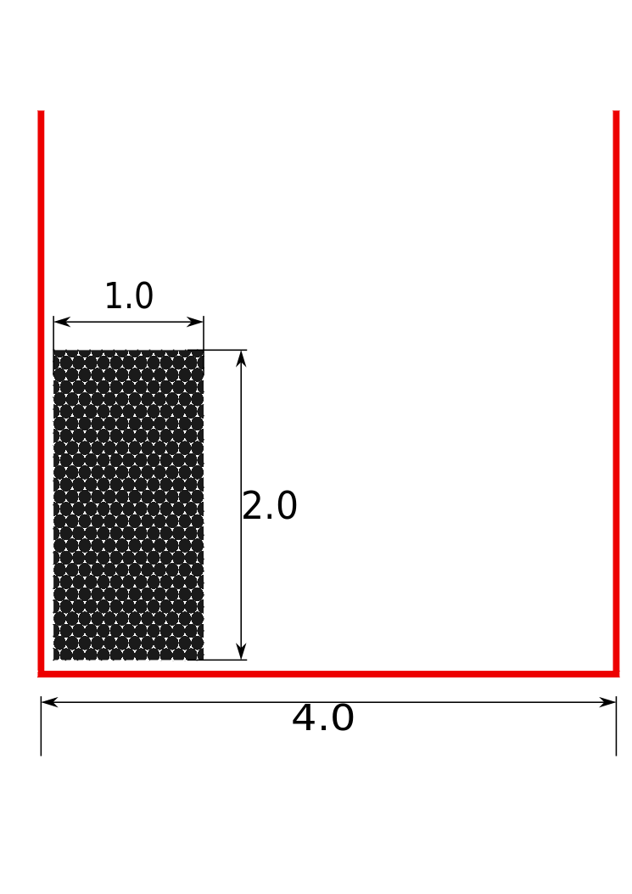

==============================
Moving on
==============================

--------------------------------
The breaking dam
--------------------------------

In the :doc:`getting_started` guide, we saw how to setup a simple
problem (N-Body problem) in PySPH. In :doc:`application`, we solved
the same problem with the application interface which gave us a
convenient way to visualize results using the Mayavi particle viewer.
We now proceed to solve the dam break problem using PySPH.

^^^^^^^^^^^^^^^^^^^^^^^^^^^^^^^
Problem specification
^^^^^^^^^^^^^^^^^^^^^^^^^^^^^^^

The initial configuration for the problem is shown in the figure:

.. _figure_dam_break_configuration:

A column of water is initially at rest (presumably held in place by
some membrane). The problem simulates a breaking dam in that the
membrane is instantly removed and the column is free to fall under
it's own weight and the effect of gravity. This and other variants of
the dam break problem can be found in the *examples/dam-break*
directory of PySPH.

^^^^^^^^^^^^^^^^^^^^^^^^^^^^^^^
Equations
^^^^^^^^^^^^^^^^^^^^^^^^^^^^^^^

The equations to be solved are

.. math::
   :label: eos 

   p_a = B\left( \left(\frac{\rho_a}{\rho_0}\right)^{\gamma} - 1 \right )

.. math::
   :label: continuity
 
   \frac{D\rho_a}{Dt} = \sum_{b=1}^{N}m_b\,(\vec{v_b} - \vec{v_a})\cdot\,\nabla_a W_{ab}

.. math::
   :label: momentum
   
   \frac{D\vec{v_a}}{Dt} = -\sum_{b=1}^Nm_b\left(\frac{p_a}{\rho_a^2} + \frac{p_b}{\rho_b^2}\right)\nabla W_{ab}

.. math::
   :label: position

   \frac{D\vec{x_a}}{Dt} = \vec{v_a}

^^^^^^^^^^^^^^^^^^^^^^^^^^^^^^^
Boundary Conditions
^^^^^^^^^^^^^^^^^^^^^^^^^^^^^^^

The dam break problem involves two *types* of particles. Namely,
*Fluid* (water column) and *Solid* (tank). The basic boundary
condition enforced on a solid wall like the tank is the no-penetration
boundary condition. This boundary condition can be stated as:

.. math::

   \vec{v_f}\cdot \vec{n_b} = 0

Where :math:`\vec{n_b}` is the local normal vector for the
boundary. For this example, we use the dynamic boundary conditions
[Crespo2007]_. 

For this boundary condition, the boundary particles evolve with the
continuity (:eq:`continuity`) and equation the of state
(:eq:`eos`), and contribute to the fluid acceleration via the
momentum equation (:eq:`momentum`). 

When fluid particles approach a solid wall, the density of the fluids
and the solids increase via the continuity equation. With the
increased density and consequently increased pressure, the boundary
particles express a repulsive force on the fluid particles, thereby
enforcing the no-penetration condition.

^^^^^^^^^^^^^^^^^^^^^^^^^^^^^^^
PySPH solution
^^^^^^^^^^^^^^^^^^^^^^^^^^^^^^^

The code to solve the problem is shown below

.. sourcecode:: python
    :linenos:

    import numpy
    import pysph.base.api as base
    import pysph.solver.api as solver
    import pysph.sph.api as sph

    from pysph.tools import geometry_utils as geom

    Fluid = base.Fluid
    Solid = base.Solid

    fluid_column_height = 2.0
    fluid_column_width  = 1.0
    container_height = 3.0
    container_width  = 4.0

    h = 0.0390
    dx = dy = 0.03
    ro = 1000.0
    co = 10 * numpy.sqrt(2*9.81*fluid_column_height)

    gamma = 7.0
    alpha = 0.3
    eps = 0.5

    B = co*co*ro/gamma

    def get_boundary_particles():
        """ Get the particles corresponding to the dam and fluids """

        xb1, yb1 = geom.create_2D_tank(x1=0, y1=0,
                                           x2=container_width, y2=container_height,
                                           dx=dx)
        xb2, yb2 = geom.create_2D_tank(x1=-dx/2, y1=-dx/2,
                                       x2=container_width, y2=container_height,
                                       dx=dx)

        xb = numpy.concatenate((xb1, xb2))
        yb = numpy.concatenate((yb1, yb2))

        hb = numpy.ones_like(xb)*h
        mb = numpy.ones_like(xb)*dx*dy*ro*0.5
        rhob = numpy.ones_like(xb) * ro

        cb = numpy.ones_like(xb)*co

        boundary = base.get_particle_array(cl_precision="single",
                                           name="boundary", type=Solid, 
                                   x=xb, y=yb, h=hb, rho=rhob, cs=cb,
                           m=mb)

        print 'Number of Boundary particles: ', len(xb)

        return boundary

    def get_fluid_particles():
        xf1, yf1 = geom.create_2D_filled_region(x1=dx, y1=dx,
                                x2=fluid_column_width,
                            y2=fluid_column_height,
                            dx=dx)

        xf2, yf2 = geom.create_2D_filled_region(x1=dx/2, y1=dx/2,
                                x2=fluid_column_width,
                            y2=fluid_column_height,
                            dx=dx)

        x = numpy.concatenate((xf1, xf2))
        y = numpy.concatenate((yf1, yf2))

        print 'Number of fluid particles: ', len(x)

        hf = numpy.ones_like(x) * h
        mf = numpy.ones_like(x) * dx * dy * ro * 0.5
        rhof = numpy.ones_like(x) * ro
        csf = numpy.ones_like(x) * co

        fluid = base.get_particle_array(cl_precision="single",
                        name="fluid", type=Fluid,
                        x=x, y=y, h=hf, m=mf, rho=rhof,
                        cs=csf)
        return fluid

    def get_particles(**args):
        fluid = get_fluid_particles()
        boundary = get_boundary_particles()
        return [fluid, boundary]

    # create the application
    app = solver.Application()

    integrator_type = solver.PredictorCorrectorIntegrator
    s = solver.Solver(dim=2, integrator_type=integrator_type)

    kernel = base.CubicSplineKernel(dim=2)

    ##################################################################
    # Add the operations
    ##################################################################

    # Equation of state
    s.add_operation(solver.SPHOperation(
        
	    sph.TaitEquation.withargs(hks=False, co=co, ro=ro),
	    			    on_types=[Fluid, Solid], 
				        updates=['p', 'cs'],
				        id='eos'),
                
				)

    # Continuity equation
    s.add_operation(solver.SPHIntegration(
        
	    sph.SPHDensityRate.withargs(hks=False),
					on_types=[Fluid, Solid], 
					from_types=[Fluid, Solid], 
					updates=['rho'], id='density')
                
		                )

    # momentum equation
    s.add_operation(solver.SPHIntegration(
        
	    sph.MomentumEquation.withargs(alpha=alpha, beta=0.0, hks=False),
	    				  on_types=[Fluid],
					  from_types=[Fluid, Solid],  
					  updates=['u','v'], id='mom')
                    
		                 )

    # Gravity force
    s.add_operation(solver.SPHIntegration(
        
		sph.GravityForce.withargs(gy=-9.81),
					  on_types=[Fluid],
					  updates=['u','v'],id='gravity')
                
				  )

    # Position stepping and XSPH correction operations
    s.add_operation(solver.SPHIntegration(
        
		sph.PositionStepping.withargs(),
					  on_types=[Fluid],
					  updates=['x','y'],id='step')
                
				  )

    s.add_operation(solver.SPHIntegration(
        
		sph.XSPHCorrection.withargs(),
					  on_types=[Fluid],
					  updates=['x','y'],id='xsph')
                
				  )

    dt = 1e-4
    s.set_final_time(3.0)
    s.set_time_step(dt)

    app.setup(
	solver=s,
	variable_h=False, create_particles=get_particles, min_cell_size=4*h,
	locator_type=base.NeighborLocatorType.SPHNeighborLocator,
	domain_manager=base.DomainManagerType.DomainManager,
	cl_locator_type=base.OpenCLNeighborLocatorType.AllPairNeighborLocator
	)

    # this tells the solver to compute the max time step dynamically
    s.time_step_function = solver.ViscousTimeStep(co=co,cfl=0.3,
                                              particles=s.particles)

    app.run()

The steps taken to solve this problem and indeed, any problem with
PySPH are the same (:ref:`basic-steps`). We assume the code to
generate the particles is easily understood by the reader. What
follows is a discussion on creating the solver for this particular
problem.

^^^^^^^^^^^^^^^^^^^^^^^^^^^
Discussion
^^^^^^^^^^^^^^^^^^^^^^^^^^^

Each :class:`Solver` object in PySPH can be distinguised by the
operations it performs on it's set of particles. Indeed, we cannot
expect a solver for gas-dynamics (compressible flow) to give accurate
results for an incompressible problem like the breaking dam. 

Recall that the number of operations for a particular problem is at
least equal to the number of continuous equations being solved.

""""""""""""""""""
Equation of state
""""""""""""""""""

The continuous form of this equation (:eq:`eos`) describes the relation
between the particle pressure and density. 

Note that the function is monotone increasing with density which means
that higher densities result in higher pressures. Recall that for the
simulated boundary conditions, we require that the density and
pressure of the solid particles be evolved along with the fluid.

Thus, we tell PySPH to update the pressure and speed of sound for
**all** *Fluids* and **all** *Solids*::

    s.add_operation(solver.SPHOperation(
        
	    sph.TaitEquation.withargs(hks=False, co=co, ro=ro),
	    			      on_types=[Fluid, Solid], 
				      updates=['p', 'cs'],
				      id='eos'),
                
				)

"""""""""""""""""""""
Continuity equation
"""""""""""""""""""""

Once again, owing to kind of boundary conditions employed, we require
that the density for **all** *Fluids* must be updated whilst taking
contributions from **all** *Fluids* and **all** *Solids*. A similar
consideration holds for the solid particles. Moreover, the continuity
equation (:eq:`continuity`) represents an integration for the density
variable. Thus, the operation is added like so::

    s.add_operation(solver.SPHIntegration(
        
	    sph.SPHDensityRate.withargs(hks=False),
					on_types=[Fluid, Solid], 
					from_types=[Fluid, Solid], 
					updates=['rho'], id='density')
                
		                )	   

Notice that we provided an argument *from_types* as this operation
uses neighbor information. That is, there are distinct *sources* and
*destinations* for this operation.

Refer to :doc:`../design/sources_and_destinations` for a complete
discussion of sources and destinations.

""""""""""""""""""""""""""
Momentum equation
""""""""""""""""""""""""""

Recall that the continuous form of the momentum equation reads

.. math::    \frac{D\vec{v}}{Dt} = -\frac{1}{\rho}\nabla(P) + \mu\nabla^2(\vec{v}) + \vec{g}

This equation is valid for the fluids. However, for the boundary
conditions, we need to include the solid particles for the
contribution of forces. We expect that the gradient of pressure term
will effect a repulsive force on the fluid particles as it approaches
a solid wall.

Thus, while computing the acceleration for **all** *Fluids*, we must
consider the contribution from **all** *Fluids* and **all**
*Solids*::

    s.add_operation(solver.SPHIntegration(
        
	    sph.MomentumEquation.withargs(alpha=alpha, beta=0.0, hks=False),
	    				  on_types=[Fluid],
					  from_types=[Fluid, Solid],  
					  updates=['u','v'], id='mom')
                    
		                 )

The operation performs an integration of the variables *u* and *v* as
reflected in the *updates* parameter.

""""""""""""""""""""""
Gravity force
""""""""""""""""""""""

The gravitational acceleration must be included for all particles that
are free to fall under the effect of gravity. In this example, **all**
*Fluids*::

    s.add_operation(solver.SPHIntegration(
        
		sph.GravityForce.withargs(gy=-9.81),
					  on_types=[Fluid],
					  updates=['u','v'],id='gravity')
                
				  )

The operation represents an integration and updates the variables *u*
and *v*.

"""""""""""""""""""""""""""
Position stepping
"""""""""""""""""""""""""""

The Lagrangian nature of SPH requires that particles be advected with
the local fluid velocity. In our example, the position of **all**
*Fluids* are updated. 

In addition, we perform an additional operation that moves the
particles on a local smoothed velocity. This is typically called the
XSPH correction::

    s.add_operation(solver.SPHIntegration(
        
		sph.PositionStepping.withargs(),
					  on_types=[Fluid],
					  updates=['x','y'],id='step')
                
				  )

    s.add_operation(solver.SPHIntegration(
        
		sph.XSPHCorrection.withargs(),
					  on_types=[Fluid],
					  updates=['x','y'],id='xsph')
                
				  )

Both the operations represent integration operations and update the
particle positions *x* and *y*.

^^^^^^^^^^^^^^^^^^^^^^^^^^^
Results
^^^^^^^^^^^^^^^^^^^^^^^^^^^
