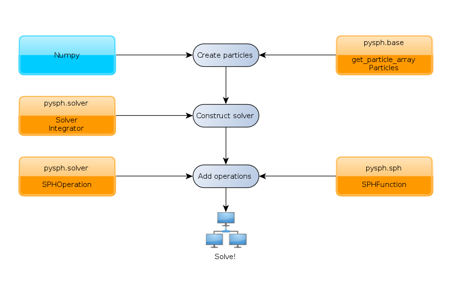

=============================
Starting off
=============================

PySPH is a framework for Smoothed Particle Hydrodynamics in `Python
<http://www.python.org>`_. The framework lets you define arbitrary
collections of particles and how they interact with each other. To get
a feel for what PySPH can do, consider the following simple example.

------------------------------
N-Body simulation using PySPH
------------------------------

Consider a system of points which is governed by the following equations:
 .. math::

	\frac{D\vec{v_i}}{Dt} = \sum_{j=1}^{N} \frac{m_j}{|x_j - x_i|^3} (\vec{x_j} - \vec{x_i})\,\, \forall i \neq j

	\frac{Dx_i}{Dt} = \vec{v_i}

Thus, given the initial positions and velocities of the particles, we can numerically integrate the system to some 
final time. Let's see how to do this in PySPH!

..  sourcecode:: python
	:linenos:

	import pysph.base.api as base
	import pysph.solver.api as solver
	import pysph.sph.api as sph
	import numpy
	
	Fluid = base.ParticleType.Fluid
	
	# Generate random points in the cube [-1, 1] X [-1, 1] X [-1,1]
	x = numpy.random.random(1000) * 2.0 - 1.0
	y = numpy.random.random(1000) * 2.0 - 1.0
	z = numpy.random.random(1000) * 2.0 - 1.0
	m = numpy.random.random(1000)
	
	pa = base.get_particle_array(name="test", cl_precision="single",
                                     type=Fluid, x=x, y=y, z=z, m=m)

	particles = base.Particles(arrays=[pa,],
				   locator_type=base.NeighborLocatorType.NSquaredNeighborLocator)
	
	s = solver.Solver(dim=3, 
	                  integrator_type=solver.PredictorCorrectorIntegrator)
	
	s.add_operation(solver.SPHIntegration(
	
			sph.NBodyForce.withargs(),
			on_types=[Fluid], from_types=[Fluid],
			updates=['u','v','w'], id='nbody_force')
			
			)
			
	s.add_operation_step([Fluid,])
	s.set_final_time(1.0)
	s.set_time_step(1e-4)
	
	s.setup_integrator(particles)
	
	s.solve()

This example demonstrates the steps used to solve a problem with PySPH.

.. _basic-steps:

    Basic steps to solve a problem using PySPH

^^^^^^^^^^^^^^^^^^^^^^^
Creating the  Particles
^^^^^^^^^^^^^^^^^^^^^^^

A particle simulation is governed by a number of particles which have
properties like mass, density etc. associated with them. The system
may be heterogeneous in that solid and fluid particles co-exist, each
having a different set of properties. To satisfy these requirements,
we represent a homogeneous set of particles in a container,
**ParticleArray**, which has an associated type (fluid, solid) and
property arrays. A **ParticleArray**, with named properties (x,
y...)is created from Numpy_ arrays like so .::

       	pa = base.get_particle_array(name="test", cl_precision="single",
                                     type=Fluid, x=x ...)

You may define an arbitrary collection of particle arrays with the
only restriction that the names of each be unique. You may add,
delete, append and extract a subset of the particles. See
:doc:`reference/particle_array` for more information on the use of
**ParticleArray**.

Once we have defined the individual particle arrays, we put them into
a common container, **Particles**, which is then passed around to make
access to the arrays easier.::

	particles = base.Particles(arrays=[pa1,pa2,...], 
                                   locator_type=base.NeighborLocatorType.NSquaredNeighborLocator)

The **Particles** constructor (:doc:`reference/particles`)accepts
arguments for the kind of spatial indexing scheme which is used for
fast neighbor queries. For this example, we need an all-pair neighbor
locator. See :doc:`design/nnps` for a better understanding of how
neighbors for a particular particle are sought in PySPH.

^^^^^^^^^^^^^^^^^^^^^^
Creating the Solver
^^^^^^^^^^^^^^^^^^^^^^

Now that we have the particles and a means to get neighbors, we
construct a **Solver** instance, which is used to drive the
simulation. We must specify the dimensionality of the problem and the
type of integration required. ::

	s = solver.Solver(dim=3, integrator_type=solver.PredictorCorrectorIntegrator)

^^^^^^^^^^^^^^^^^^^^^^
Adding Operations
^^^^^^^^^^^^^^^^^^^^^^

The solver constructed can accomplish nothing as it is unaware of the
particles. Even if it knew about the particles, it couldn't do
anything with them. This is because we have not told PySPH what the
particles are going to do. That is, how are they going to interact
with each other. We do this by adding **Operations** to the solver
which tell PySPH fairly explicitly how the particles are going to
interact.::

	s.add_operation(solver.SPHIntegration

			sph.NBodyForce.withargs(),
			on_types=[Fluid], from_types=[Fluid],
			updates=['u','v','w'], id='nbody_force'

			)

We typically add an operation for each equation in the problem
statement. In our example, we have two equations and thus, two
operations. The code above tells PySPH to add an integration operation
to the system, using the **NBodyForce** for the forcing function which
updates three variables (u, v, w).

In addition, the *on_types* and *from_types* parameter tell PySPH to:

   "Consider all particle arrays of type *Fluid* for the lhs of the
    equation (subscript i) and all particle arrays of type *Fluid* for 
    the rhs (subscript j) " 

Along similar lines, the second operation could have been added as::

	s.add_operation(solver.SPHIntegration
	
			sph.PositionStepping.withargs(),
			on_types=[Fluid], updates=['x','y','z'],
			id='step'
			
			)

But we opt for the simpler statement::

	s.add_operation_step(types=[Fluid])

which does just that.

See :doc:`design/sph_operations` for the different types of operations
that can be defined with PySPH.

^^^^^^^^
Solve
^^^^^^^^

Now that the operations are defined, we setup the integrator, solver
constants and run::

	s.setup_integrator(particles)
	s.set_final_time(1.0)
	s.set_time_step(1e-4)
	
	s.solve()

^^^^^^^^
Summary
^^^^^^^^

In this example, we created a set of particles in PySPH using a
ParticleArray, constructed a Solver and added Operations to the Solver
to determine how the particles interact with each other. 

One would run the above script like so::
    
    $ python nbody.py

But what if we wanted to change the final time or time step for the
run? If we have a GPU available, we might want to accelerate
computations by taking advantage of the processing power available to
us. Moreover, we would like to visualize the results live. These and
many more options are configurable from the command line through the
use of the recommended application (see :doc:`application`) interface.

.. _PyOpenCL: http://mathema.tician.de/software/pyopencl
.. _Numpy: http://numpy.scipy.org/

..  LocalWords:  ParticleArray
