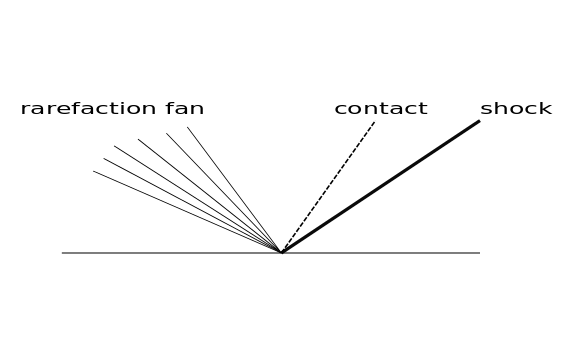
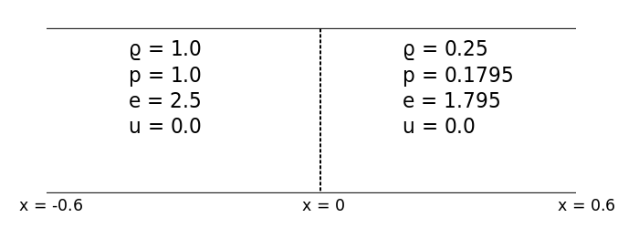
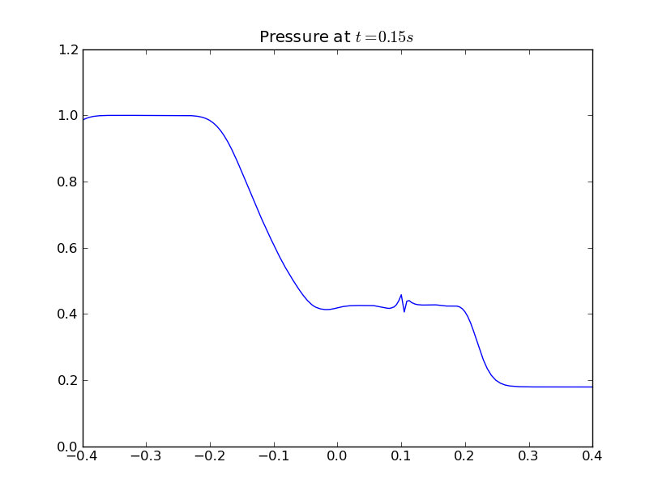

.. _shock_tube:

===============================
The shock tube problem
===============================
    
The shock tube problem was one of the first extensions of SPH outside
the field of astrophysics, for which it was developed
[Monaghan1983]_. The equations solved are the inviscid Navier Stokes
equations or the Euler equations. The shock tube problem is the
starting point for schemes that attempt to resolve discontinuities
like shocks and entropy waves.

----------------------------------
Problem definition
----------------------------------

The shock tube problem consists of a tube of fluid that is initially
at rest. A central diaphragm in the tube separates two states of the
fluid. The fluid to the left has a higher pressure and energy as
compared with the fluid on the right. We study the evolution of the
fluid as the diaphragm is ruptured instantaneously.

The exact solution to this problem is known.. It consists of a shock
wave moving to the right, a contact discontinuity moving with the
speed of the fluid to the right and a rarefaction moving to the left
as shown in the figure.

.. _shock_exact:

.. _euler-equations:

^^^^^^^^^^^^^^^^^^^^^^^^^^^^^^^^^^^
Euler equations
^^^^^^^^^^^^^^^^^^^^^^^^^^^^^^^^^^^

The Euler equations are, the continuity equation:

.. math::

    \frac{D\rho}{Dt} = -\rho\nabla \, \cdot \vec{v},

the momentum equation:

.. math::
   \frac{D\vec{v}}{Dt} = -\frac{1}{\rho}\nabla(P),

the thermal energy equation:

.. math::
   \frac{De}{Dt} = -\left( \frac{P}{\rho} \right)\,\nabla\,\cdot \vec{v},

and the ideal gas equation of state:

.. math::

   p = (\gamma -1)\rho e  ,\  \gamma = 1.4

----------------------------------------
SPH Equations
----------------------------------------

The standard SPH discretization for the :ref:`euler-equations` are:

continuity equation or summation density:

.. math::

   \rho_a = \sum_{b=1}^{N} m_b\,W_{ab},

the momentum equation:

.. math::

   \frac{Du_a}{Dt} = -\sum_{b=1}^{N}m_b\left( \frac{P_a}{\rho_a^2} + \frac{P_b}{\rho_b^2} + \Pi_{ab} \right )\,\nabla_a\,W_{ab}

the energy equation:

.. math::

   \frac{De_a}{Dt} = \frac{1}{2}\sum_{b=1}^{N}m_b\left( \frac{P_a}{\rho_a^2} + \frac{P_b}{\rho_b^2} + \Pi_{ab} \right )\cdot\,\nabla_aW_{ab},

the equation of state:

.. math::

   p_a = (\gamma - 1)\rho_a e_a,

and the advection step:

.. math::

   \frac{D{x_a}}{Dt} = u_a

To handle shocks that may develop in the solution, an artificial
viscosity term, :math:`\Pi_{ab}` is added to the momentum and thermal
energy equation [Monaghan1992]_

---------------------------------
Boundary conditions
---------------------------------

The dam break problem is simulated without any boundary
conditions. Typically, the domain of interest is chosen large enough
so that the errors from the boundary do not propagate into the region
of interest.

---------------------------------
Discretzation
---------------------------------

The initial fluid states on either side of the diaphragm is shown in
the figure:

.. _shock-tube-description:

   Shock tube problem

^^^^^^^^^^^^^^^^^^^^^^^^^^^^^^^^^^
Initial distribution
^^^^^^^^^^^^^^^^^^^^^^^^^^^^^^^^^^

:math:`400` particles are placed in the interval :math:`[-0.6, 0.6]`
with the following distribution:

:math:`320` particles are equally spaced in the domain :math:`-0.6
\leq x < 0`, resulting in an inter-particle spacing :math:`\Delta x_l
= 0.001875`.

:math:`80` particles are equally spaced in the domain :math:`0 < x
\leq 0.6`, resulting in an inter-particle spacing :math:`\Delta x_r =
0.0075`.

^^^^^^^^^^^^^^^^^^^^^^^^^^^^^^^^^^^^^
Numerical parameters
^^^^^^^^^^^^^^^^^^^^^^^^^^^^^^^^^^^^^

The mass of each particle is constant an equal to the inter-particle
spacing on the left. This choice is consistent with the initial
density distribution for the problem. The smoothing length is a
constant and is equal to twice the inter-particle spacing on the
right.

----------------------------------
Running the example 
----------------------------------

The example code for this problem is located in the
:file:`examples/shock-tube` directory and can be run like so::

	$ cd examples/shock-tube
	$ python shock_tube.py

This will create a solution directory :file:`shock_tube_output` and by
default, dump output files every twenty iterations. Each output
file-name is of the form :file:`shock_tube_0_count.npz` where, *count*
is the iteration count for that particular file.

--------------------------------------
Results
--------------------------------------

Results for the shock tube problem are usually depicted as a plot of a
primitive variable (:math:`u, \,\, \rho, \,\, p`) versus
distance. 

Recall that the output files were put in a directory
:file:`shock_tube_output`. Move to that directory and launch a
Python interpreter::

    $ cd shock_tube_output
    $ ipython -pylab

Execute the following in the interpreter:

.. sourcecode:: python

   import pysph.solver.api as solver

   data = solver.load("shock_tube_0_500.npz")
   array = data["arrays"]["fluid"]
   solver_data = data["solver_data"]
   plot(array.p, array.x)
   xlim(-.4,.4)

   dt = solver_data["dt"]
   title(r"Pressure at $t = %f$"%(dt))

to produce the pressure plot as shown below: 

.. _shock-tube-sample-plot:

--------------------------------------------------
Discussion
--------------------------------------------------

The results produced by the standard SPH scheme are
unsatisfactory. There appears to be a blip in the pressure at the
location of the contact discontinuity and the shock profiles are very
smooth. We could increase the number of particles to get sharper
profiles but the blip remains. Indeed, you can experiment by
increasing the number of particles to observe this behavior.

The solution is to add a wall heating term to the energy equation
according to [Noh1978]_. In addition, dynamically updating the
smoothing length according to the local particle number density
results in a scheme that is better suited to capture shocks than the
standard SPH. One approach to updating the smoothing length is the
Adaptive Kernel Estimation technique (ADKE) of [Sigalotti2006]_.

The other examples in the directory :file:`examples/shock-tube`
implement this ADKE procedure along with the addition of an artificial
heat term to the energy equation. These are briefly discussed below.

