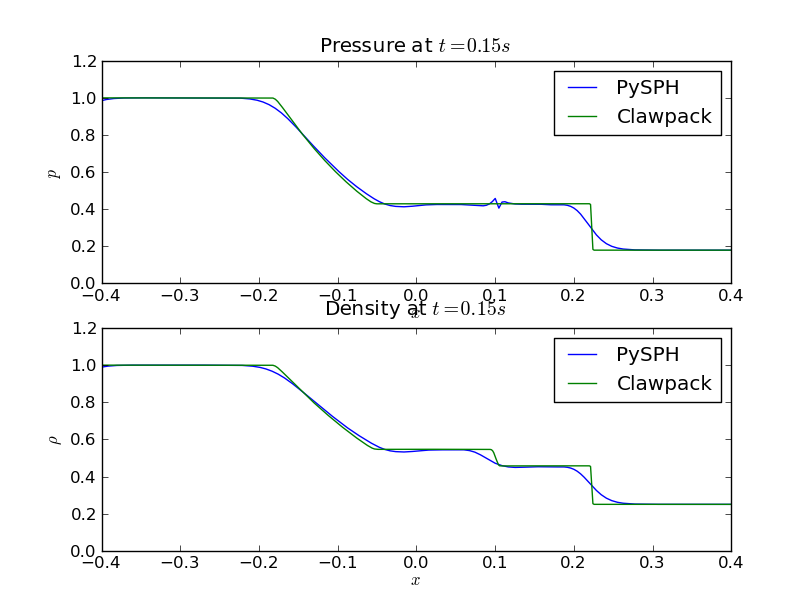

.. _shock_tube:

---------------------------
One dimensional shock tube
---------------------------
    
SPH was developed as a scheme to solve problems in astrophysics and
one of the first extensions of the scheme was to solve the shock tube
problem [Monaghan1983]_. 

The problem consists of a quiescent mass of fluid initially separated
by a diaphragm. The fluid state on the left is hotter ad denser than
that on the right. At the start of the simulation, the diaphragm is
punctured. The fluid is assumed to be inviscid and is governed by the
Euler equations of gas dynamics. The exact solution to the shock tube
problem is well known. It consists of a shock wave moving to the
right, a contact discontinuity moving with the speed of the fluid to
the right and a rarefaction moving to the left as shown in the figure.

.. _shock_exact:
.. figure:: images/shock-exact.png
    :align: center
    :width: 500

The conservation equations to be solved, written in SPH form are:

.. math::

   p = \rho(\gamma - 1)e

   m_a = \sum_{b=1}^{N} m_b\,W_{ab}

   \frac{Du_a}{Dt} = -\sum_{b=1}^{N}m_b\left( \frac{P_a}{\rho_a^2} + \frac{P_b}{\rho_b^2} + \Pi_{ab} \right )\,\nabla_a\,W_{ab}

   \frac{De_a}{Dt} = \frac{1}{2}\sum_{b=1}^{N}m_b\left( \frac{P_a}{\rho_a^2} + \frac{P_b}{\rho_b^2} + \Pi_{ab} \right )\cdot\,\nabla_aW_{ab}

   \frac{D{x_a}}{Dt} = u_a

These are the equation of state, conservation of mass, conservation of
momentum, conservation of energy and position stepping equations
respectively.

^^^^^^^^^^^^^^^^^^^^^^^^^^^^^^^^^^
PySPH solution
^^^^^^^^^^^^^^^^^^^^^^^^^^^^^^^^^^
   
The code to solve this problem is:

..  sourcecode:: python
	:linenos:

	import pysph.base.api as base
	import pysph.solver.api as solver
	import pysph.sph.api as sph

	Fluid = base.Fluid

	Locator = base.NeighborLocatorType

	nl = 320
	nr = 80

	app = solver.Application()

	s = solver.Solver(dim=1, integrator_type=solver.RK2Integrator)

	s.add_operation(solver.SPHOperation(

		sph.IdealGasEos.withargs(),
		on_types=[Fluid],
		updates=["p", "cs"],
		id="eos"

		)

	s.add_operation(solver.SPHOperation(

		sph.SPHRho.withargs(),
		on_types=[Fluid],
		updates=["rho"],
		id="summation_density"

		)

	s.add_opeation(solver.SPHIntegration(
   
		sph.MomentumEquation.withargs(alpha=1.0, beta=1.0),
		on_types=[Fluid], from_types=[Fluid],
		updates=["u"],
		id="momentum_equation"

		)

	s.add_opeation(solver.SPHIntegration(

		sph.EnergyEquation.withargs(alpha=1.0, beta=1.0),
		on_types=[Fluid], from_types=[Fluid],
		updates=["e"],
		id="momentum_equation"

		)

	s.add_opeation(solver.SPHIntegration(

		sph.PositionStepping.withargs(),
		on_types=[Fluid],
		updates=["x"],
		id="momentum_equation"

		)

	app.setup(solver=s,
	     variable_h=False,
	     create_particles=solver.shock_tube_solver.standard_shock_tube_data,
	     name='fluid', type=0,
	     locator_type=Locator.SPHNeighborLocator,
	     nl=nl, nr=nr)

	s.set_final_time(0.15)
	s.set_time_step(3e-4)

	app.run()

We compare the results obtained using PySPH with those obtained using
Clawpack_:

.. _shock-tube-solution:

.. [Monaghan1983] Shock Simulation by the Particle Method SPH. J.J. Monaghan, Journal of Computational Physics, Vol 52, pp (374-389)

.. _Clawpack: http://www.clawpack.org
